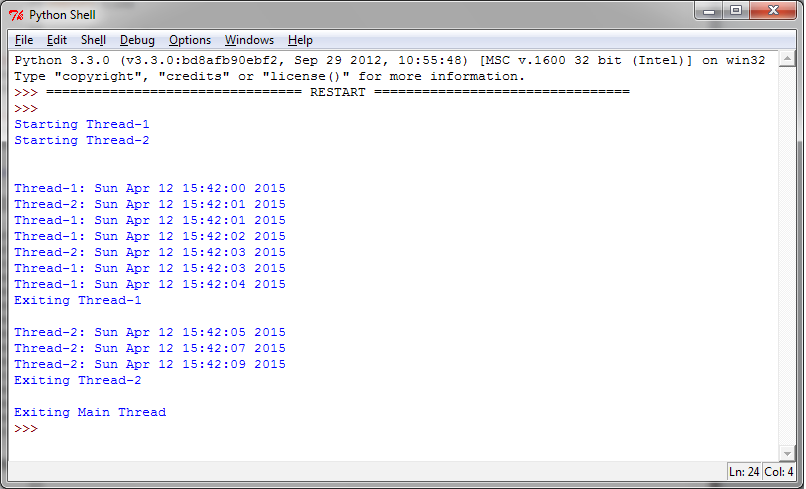

# 如何实现一个线程

使用threading模块实现一个新的线程，需要下面3步：

-   定义一个 `Thread` 类的子类
-   重写 `__init__(self [,args])` 方法，可以添加额外的参数
-   最后，需要重写 `run(self, [,args])` 方法来实现线程要做的事情

当你创建了新的 `Thread` 子类的时候，你可以实例化这个类，调用 `start()` 方法来启动它。线程启动之后将会执行 `run()` 方法。

为了在子类中实现线程，我们定义了 `myThread` 类。其中有两个方法需要手动实现： :

```python
'''
Date: 2021.06.01 10:58
Description : Omit
LastEditors: Rustle Karl
LastEditTime: 2021.06.01 10:58
'''
import threading
import time

exitFlag = 0


class MyThread(threading.Thread):
    def __init__(self, thread_id, name, counter):
        threading.Thread.__init__(self)
        self.threadID = thread_id
        self.name = name
        self.counter = counter

    def run(self):
        print("Starting " + self.name)
        print_time(self.name, self.counter, 5)
        print("Exiting " + self.name)


def print_time(thread_name, delay, counter):
    while counter:
        if exitFlag:
            import _thread
            _thread.exit()
        time.sleep(delay)
        print("%s: %s" % (thread_name, time.ctime(time.time())))
        counter -= 1


# Create new threads
thread1 = MyThread(1, "Thread-1", 1)
thread2 = MyThread(2, "Thread-2", 2)

# Start new Threads
thread1.start()
thread2.start()

thread1.join()
thread2.join()

print("Exiting Main Thread")
```

上面的代码输出结果如下：



`threading` 模块是创建和管理线程的首选形式。每一个线程都通过一个继承 `Thread` 类，重写 `run()` 方法来实现逻辑，这个方法是线程的入口。在主程序中，我们创建了多个 `myThread` 的类型实例，然后执行 `start()` 方法启动它们。调用 `Thread.__init__` 构造器方法是必须的，通过它我们可以给线程定义一些名字或分组之类的属性。调用 `start()` 之后线程变为活跃状态，并且持续直到 `run()` 结束，或者中间出现异常。所有的线程都执行完成之后，程序结束。

`join()` 命令控制主线程的终止。
