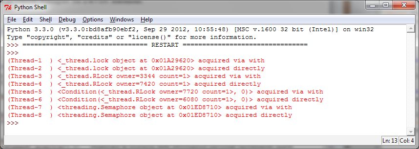

# 使用with语法

Python从2.5版本开始引入了 `with` 语法。此语法非常实用，在有两个相关的操作需要在一部分代码块前后分别执行的时候，可以使用 `with` 语法自动完成。使用 `with` 语法可以在特定的地方分配和释放资源，因此，`with` 语法也叫做"上下文管理器"。在threading模块中，所有带有 `acquire()` 方法和 `release()` 方法的对象都可以使用上下文管理器。

也就是说，下面的对象可以使用 `with` 语法：

-   Lock
-   RLock
-   Condition
-   Semaphore

在本节中，我们将使用 `with` 语法简单地尝试这四个对象。

下面的例子展示了 `with` 语法的基本用法，我们有一系列的同步原语，下面尝试用 `with` 来使用它们： :

```python
import threading
import logging
logging.basicConfig(level=logging.DEBUG, format='(%(threadName)-10s) %(message)s',)

def threading_with(statement):
    with statement:
        logging.debug('%s acquired via with' % statement)

def threading_not_with(statement):
    statement.acquire()
    try:
        logging.debug('%s acquired directly' % statement )
    finally:
        statement.release()

if __name__ == '__main__':
    # let's create a test battery
    lock = threading.Lock()
    rlock = threading.RLock()
    condition = threading.Condition()
    mutex = threading.Semaphore(1)
    threading_synchronization_list = [lock, rlock, condition, mutex]
    # in the for cycle we call the threading_with e threading_no_with function
    for statement in threading_synchronization_list :
       t1 = threading.Thread(target=threading_with, args=(statement,))
       t2 = threading.Thread(target=threading_not_with, args=(statement,))
       t1.start()
       t2.start()
       t1.join()
       t2.join()
```

下图展示了使用 `with` 的每一个函数以及用在了什么地方：



## 

在主程序中，我们定义了一个list， `threading_synchronization_list` ，包含要测试的线程同步使用的对象： :

```python
lock = threading.Lock()
rlock = threading.RLock()
condition = threading.Condition()
mutex = threading.Semaphore(1)
threading_synchronization_list = [lock, rlock, condition, mutex]
```

定义之后，我们可以在 `for` 循环中测试每一个对象： :

```python
for statement in threading_synchronization_list :
   t1 = threading.Thread(target=threading_with, args=(statement,))
   t2 = threading.Thread(target=threading_not_with, args=(statement,))
```

最后，我们有两个目标函数，其中 `threading_with` 测试了 `with` 语法： :

```python
def threading_with(statement):
    with statement:
        logging.debug('%s acquired via with' % statement)
```

在本例中，我们使用了Python的logging模块进行输出： :

```python
logging.basicConfig(level=logging.DEBUG, format='(%(threadName)-10s) %(message)s',)
```

使用 `% (threadName)` 可以在每次输出的信息都加上线程的名字。logging模块是线程安全的。这样我们可以区分出不同线程的输出。
